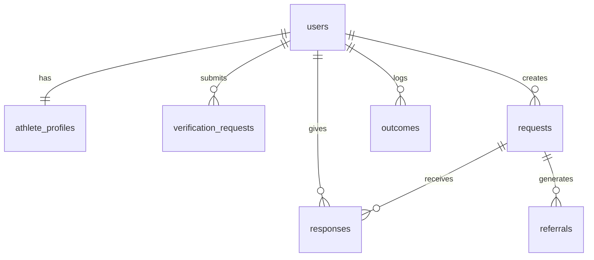

# Relay Platform - Knowledge Base

## Quick Reference

### Project Structure
```
relay-platform/
├── src/
│   ├── app/
│   │   ├── (auth)/           # Auth pages (login, signup)
│   │   ├── (dashboard)/      # Protected pages (profile, requests)
│   │   ├── auth/             # Server actions for auth
│   │   ├── layout.tsx        # Root layout
│   │   ├── page.tsx          # Landing page
│   │   └── globals.css       # Design system
│   ├── components/
│   │   ├── ui/               # Reusable UI components
│   │   └── navbar.tsx        # Navigation
│   └── lib/
│       ├── supabase/         # Supabase client setup
│       └── utils.ts          # Utility functions
├── public/                   # Static assets
└── docs/                     # Documentation
```

### Tech Stack
| Layer | Technology |
|-------|------------|
| Framework | Next.js 14 (App Router) |
| Styling | Tailwind CSS v4 |
| Database | Supabase (PostgreSQL) |
| Auth | Supabase Auth |
| Language | TypeScript |

### Environment Variables
```bash
NEXT_PUBLIC_SUPABASE_URL=<supabase-project-url>
NEXT_PUBLIC_SUPABASE_ANON_KEY=<supabase-anon-key>
```

---

## Database Schema

### Entity Relationship


### Tables Overview

| Table | Purpose | RLS |
|-------|---------|-----|
| users | User account data | ✅ |
| athlete_profiles | Athletic background | ✅ |
| verification_requests | Proof submissions | ✅ |
| requests | Career advice requests | ✅ |
| responses | Accept/decline/refer | ✅ |
| referrals | Request forwarding | ✅ |
| outcomes | Result tracking | ✅ |

---

## Design System

### Color Tokens
| Token | Purpose | CSS Variable |
|-------|---------|--------------|
| Primary | Text, buttons | `--primary` |
| Secondary | Accents (Sky blue) | `--secondary` |
| Accent | Highlights (Teal) | `--accent` |
| Muted | Backgrounds, borders | `--muted` |

### Component Library
- **Button**: Primary, outline, ghost variants
- **Card**: Container with header/content/footer
- **Input**: Form input with consistent styling
- **Select**: (To be added) Dropdown selection
- **Badge**: (To be added) Status indicators

---

## Key Flows

### Authentication
1. User visits `/signup`
2. Fills form (email, password, name, role)
3. Supabase creates auth.users entry
4. Trigger creates public.users entry
5. User redirected to `/login` with confirmation
6. User logs in → redirected to dashboard

### Verification
1. User navigates to `/profile/verify`
2. System checks for .edu email
3. If .edu: auto-verified
4. If not: user uploads proof OR requests vouching
5. Admin reviews submission
6. Status updated to verified/rejected

### Request Creation
1. User navigates to `/requests/new`
2. Fills structured form:
   - Request type
   - Context
   - Time commitment
   - Offer in return
3. AI optionally refines message
4. Request created with 7-day expiry
5. Matched alumni receive notification

### Responding to Requests
1. Alumni sees pending request
2. Options: Accept, Decline, Refer
3. If Accept: conversation begins
4. If Refer: request forwarded with context
5. Outcome logged when complete

---

## Development Commands

```bash
# Development server
npm run dev

# Production build
npm run build

# Start production server
npm start

# Lint check
npm run lint
```

---

## Supabase Project

- **Project ID**: `azozlhbwwfzcimoqcvue`
- **Region**: (configured)
- **Dashboard**: [Supabase Dashboard](https://supabase.com/dashboard/project/azozlhbwwfzcimoqcvue)

---

## Best Practices

### Adding New Pages
1. Create folder in appropriate route group
2. Add `page.tsx` with server component
3. For auth protection, check user in component
4. Use consistent Card/Container structure

### Adding Server Actions
1. Create `actions.ts` in feature folder
2. Mark with `'use server'`
3. Get supabase client via `createClient()`
4. Use `revalidatePath` after mutations

### Styling Guidelines
- Use CSS variables for colors
- Stick to defined radius values
- Max 2-4px lift on hover
- Use easing curves for animations

---

*For detailed feature specs, see [PRD.md](./PRD.md)*
